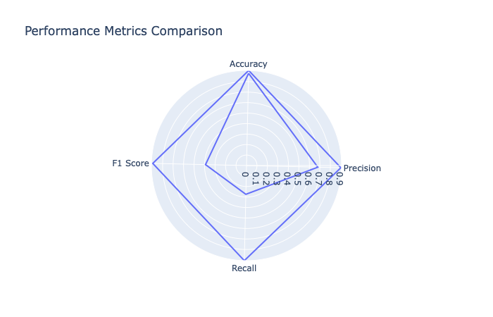

# Wine Quality Prediction Project

## Introduction


This project aims to address a crucial challenge faced by a prestigious winery: maintaining and enhancing wine quality. The winery has built a reputation for producing high-quality red wines, and this project utilizes data-driven techniques to ensure that every bottle consistently meets or exceeds customer expectations. By analyzing the chemical composition of wines, we can predict and improve wine quality.

## Business Problem

The winery's core challenge is to ensure the ongoing delivery of exceptional wine quality. To achieve this, we need to understand the key factors that contribute to wine quality. By analyzing chemical properties like alcohol content, sulphates, citric acid, total sulfur dioxide, and volatile acidity, we can predict whether a wine is of good quality. This prediction can help winemakers make real-time assessments and adjustments during production.

## Data

The dataset used for this project contains information on the chemical composition of red wines and their associated quality scores. The wine quality is rated on a scale from 3 to 8, with scores 7 or above considered as good wine quality. The chemical properties include features like alcohol content, sulphates, citric acid, total sulfur dioxide, and volatile acidity.

## Approach

#### Model Training and Selection

We initially create a baseline model using Logistic Regression and compare it with other models, such as Support Vector Classifier (SVC), K-Nearest Neighbors (KNN), and Random Forest Classifier. After model comparison, we choose the Random Forest Classifier as the best model due to its strong performance.

#### Hyperparameter Tuning

To further improve the model, we perform hyperparameter tuning using Grid Search with Cross-Validation. This process identifies the best hyperparameters to optimize the Random Forest Classifier.

#### Feature Importance Analysis

We analyze the top 5 features that have the most influence on wine quality, which can guide wine production and quality enhancement efforts.


## Results

The tuned Random Forest Classifier demonstrates significant improvements over the baseline model. Here are the key results:

- **Accuracy:** Improved to 0.9064 from the baseline model's 0.8789.
- **Precision:** Enhanced to 0.9001 from the baseline model's 0.68.
- **Recall:** Improved to 0.9064 from the baseline model's 0.2742.
- **F1 Score:** Increased to 0.8938 from the baseline model's 0.3908.

The tuned model provides a better balance between precision and recall and reduces both false negatives and false positives.


## Feature Insights

Based on the feature importance analysis, the following features significantly influence wine quality:

1. **Alcohol:** Higher alcohol content positively correlates with wine quality.
2. **Sulphates:** Sulphates act as preservatives and antioxidants and positively impact wine quality.
3. **Citric Acid:** Citric acid enhances freshness and tartness in wine.
4. **Total Sulfur Dioxide:** It contributes to chemical stability and wine preservation.
5. **Volatile Acidity:** Lower volatile acidity is preferred to prevent off-flavors.

## Recommendations

- **Maintain Alcohol Levels:** Ensure that wines have higher alcohol content (around 11.5%) for improved quality.
- **Sulphate Management:** Manage and monitor sulphate levels above 0.62 to preserve wine quality.
- **Citric Acid Usage:** Utilize citric acid strategically to enhance freshness, with the optimal range around 0.25.
- **Sulfur Dioxide Monitoring:** Monitor total sulfur dioxide levels to maintain chemical stability, aiming for values below 40.
- **Volatile Acidity Control:** Keep volatile acidity below 0.5 to prevent off-flavors and enhance overall wine enjoyment.

## Next Steps

- **Data Monitoring:** Regularly update the model with new data to maintain its accuracy.
- **Data Collection:** Continue collecting and maintaining data on chemical properties and quality ratings.
- **Further Analysis:** Explore additional factors affecting wine quality, such as environmental conditions and winemaking techniques.

## Conclusion

This project provides the winery with a powerful predictive model for assessing and improving wine quality. By focusing on key chemical properties, we can make informed decisions during production, ensuring that the winery consistently delivers exceptional wines. The project's results and insights can be integrated into the winery's operations and contribute to its commitment to excellence.

For a more detailed and technical explanation of the project, please refer to the full project report.
Please view full analysis in [Jupyter Notebook](https://github.com/nv593/Wine_Quality/blob/main/Wine%20Quality.ipynb) or [Presentation](link)

### Repository Structure

```
├── Visulizations
├── Data
├── Wine_Quality_slides.pdf
├── README.md
├── wine_analysis.ipynb

